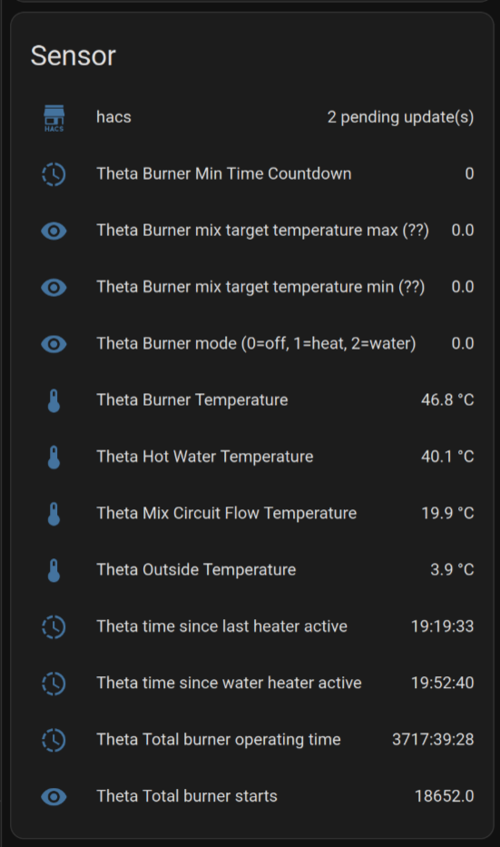
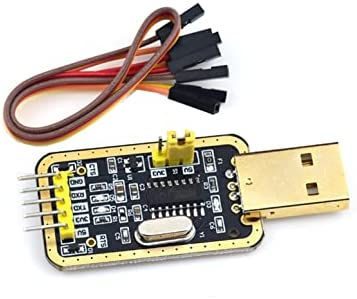
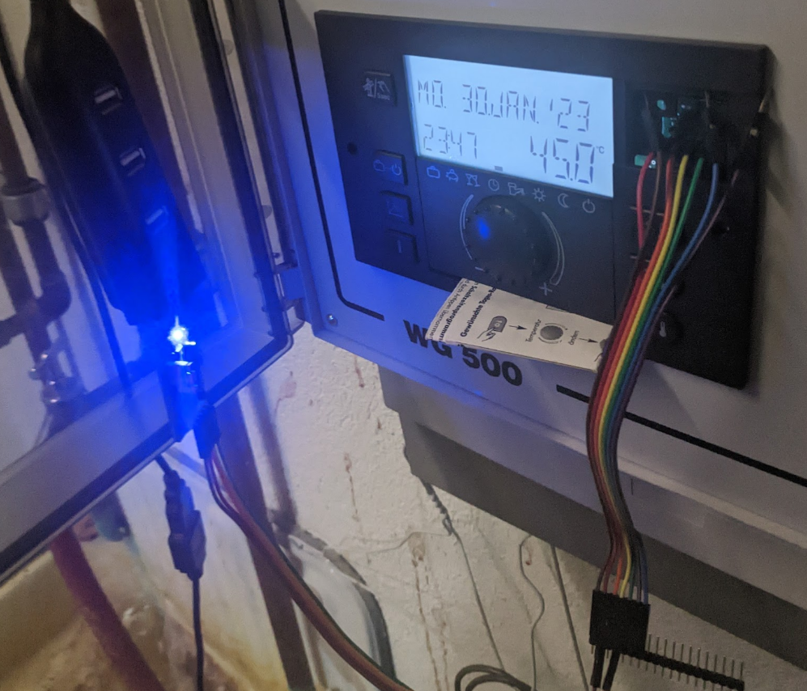
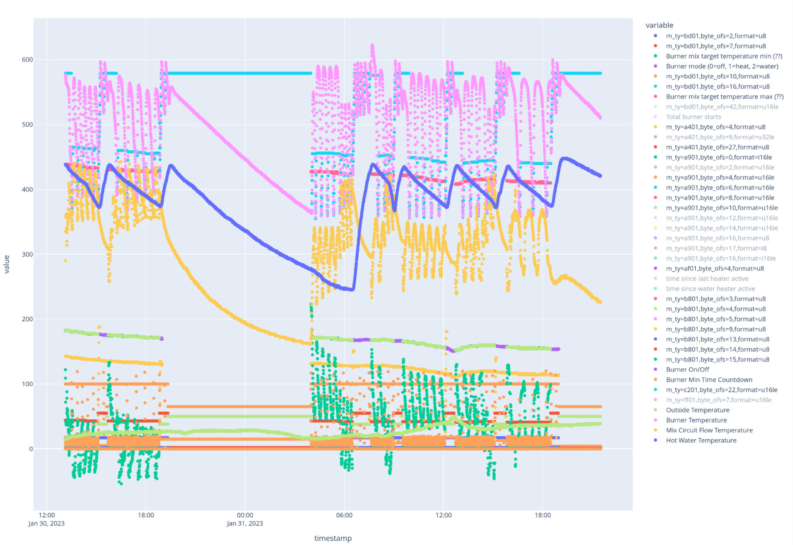
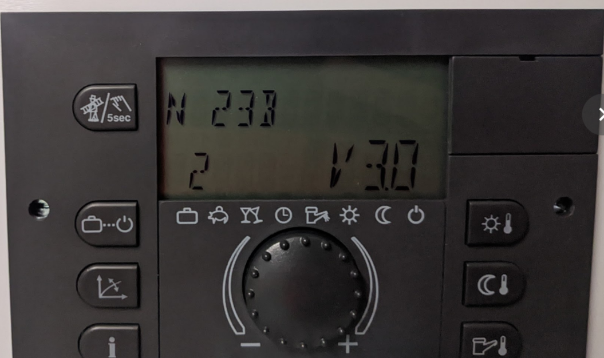

# EbV Theta to MQTT

This repo contains code to read data from an EbV Theta heating controller (Theta Heizungsregler) and send it to a MQTT broker. It also contains discovery information to make the data available as sensors in Home Assistant without any further configuration.

For some reason this device is really intransparent in what it does, has a hidden mode to get more information (Fachmann-Code 1234), and can only transmit data via a weird non-standard port (2-draht bus) to a 400€ wifi station that I can already tell has an extremely shitty app with no way to get the data into a standard system without even looking closely.

The only information about getting info out of this device is in these thread:

* https://www.mikrocontroller.net/topic/375607
* https://forum.fhem.de/index.php/topic,35720.30.html

But there wasn't really any usable information, hence this repo.

Home Assistant screenshot:



## Physical Setup

Get a CH340G USB-to-UART adapter (RS232 adapter?). I set the jumper pin on the adapter to 5V but I don't think it matters.

Open the front debug port of the Theta heating controller (top right from the display). The debug port has six pins.

You only need to connect the TX and RX pins. 

Connect RX to the third pin from the left and TX to the fifth pin from the left. (Disclaimer: I'm not sure which PIN is actually the TX pin, but this one works to ground the RX connection at least).

My adapter looks like this: 

Plugged in it looks like this: 

Connect the adapter to a Raspberry PI or some other Linux computer.

## Software Setup

Make sure you have an MQTT broker running (see [Home Assistant: MQTT](https://www.home-assistant.io/integrations/mqtt/)).

Make sure you have a Python 3.10 interpreter with  installed.

Install the dependencies and run the server script:

```
pipx install pdm
pdm install
pdm run read_dump_serve.py --help
```

If you don't like pdm you can also create a venv or whatever, look at the deps in pyproject.toml.

### read_dump_serve.py

This script will do all of the following:

* Open the serial port and start reading data
* Dump the raw data with timestamps into dumps/YYYY-mm-dd-HHZZZZ.jsonl files
* Continually parse the received data and update the state
* Open a connection to the MQTT broker and
    * Announce the known interesting entities (sensors) in the format understood by Home Assistant Auto Discovery (described here: https://www.home-assistant.io/integrations/mqtt/#mqtt-discovery )
    * Every 30 seconds, send a state update via MQTT

### protocol_parse.py dumps/*.jsonl > msg_log.txt

This script reads the raw dumps, parses them according to known_values.yaml and plots the values over time. There's lots of values in there I haven't identified. Screenshot:



It also dumps all the values (excluding 210a0a header, messagelen and checksum) separate by messagetype in a kinda analyzable hex format to stdout:

```
1305 hex=00 00 00 00
9001 hex=00 00 ff 00 00 00 00 00 00 ff ff
9a01 hex=01 8f 01 00 00 01 00 00 be 00 00 01 00 00 00 ff 00
9b01 hex=01 8f 01 00 00 01 00 00 be 00 00 01 00 00 00 ff 00
9c01 hex=00 00 00 00 00 00 00 00 00 00 00 00 00 00 00 ff 00
9d01 hex=00 90 01 00 00 01 00 00 90 01 00 00 00 00 00 ff 00
2403 hex=20 98 00 00 00 00 20 98 00 00 00 00 30 b0 00 00 00 00 33 b0 00 00 00 00
a201 hex=00 00 00 00 00 00 00 00 00 00 00 00 00 00 00 00 00 02 00 00 00 00 00 00 00 00 00 00 00 00 ff
a301 hex=00 00 00 00 00 00 00 00 00 00 00 00 00 00 00 00 00 00 00 00 00 00
a401 hex=00 00 00 01 8f 01 00 00 00 80 51 01 00 00 00 00 00 02 00 00 00 00 00 00 00 00 00 00 2f 09 ff
a501 hex=00 00 00 00 00 00 00 00 00 80 51 01 00 00 00 00 00 02 00 00 00 00 00 00 00 00 00 00 00 00 ff
a601 hex=00 00 00 00 00 00 00 00 00 00 00 00 00 00 00 00 00 02 00 00 00 00 00 00 00 00 00 00 00 00 ff
a901 hex=7a 00 ce 1b 0a 00 00 00 00 00 00 00 ce 1b 8e 1b 8e 1b 00 80 00 00
aa01 hex=00 00 00 00 00 00 00 00 00 00 00 00 00 00 00 00 00 00 00 00 00 00
ab01 hex=00 00 00 00 00 00 00 00 00 00 00 00 00 00 00 00 00 00 00 00 00 00
ae01 hex=00 00 00 01 8f 01 00 00 00 00 94 51 01 00
bd01 hex=00 01 11 00 00 00 00 2c b7 01 64 00 80 00 00 11 00 00 80 01 00 00 42 02 00 80 00 80 10 00 00 80 9a 01 8a 02 00 00 b7 01 00 00 81 b7 01
...
```


## EbV Theta RS485 Protocol

I'm not sure whether or how specific this protocol is to the specific controller / setup / installed sensors. 

Everything here is based on a EbV Theta N 23B V3.0:



This device is also rebranded (?) as Rotex, Körting Theta and probably others so something very similar is probably possible there. 

The protocol is very different than the one used by the EbV Gamma (analyzed here: https://github.com/bogeyman/gamma/wiki/Protokoll ).

The basic format is that each sent message looks like this:

```
byte offset: | 0 | 1 | 2 | 3 | 4 | 5 | 6    | 7 | 8 | ...| -2 | -1 |
content:     |startmarker|msgtype| 0 |msglen| content... | CRC16   |
```

* startmarker: always `b"\x21\x0a\x0a"`
* msgtype: probably a u16le number representing the message type. messages of the same type always seem to have the same length and content
* msglen: the message length in bytes (excluding header)
* content: a set of numbers representing some data.

I have described all the known interesting values for each message type (in my setup) in [interesting_values.yaml](interesting_values.yaml)

